# Nizaam Indexing Engine

> Domain-focused indexing and retrieval engine built on top of Nizaam Core.

Nizaam Indexing Engine is an infrastructure engine responsible for index definitions, index families, keys, entries, versions, similarity metadata, query planning and retrieval, build/update/rebuild/publication workflows, consistency, integrity, capacity, configuration, recovery, and durable operation execution.

The engine is designed to run **on top of Nizaam Core** rather than recreate Core infrastructure. Core owns engine communication, universal contracts, Control Plane coordination, transport, serialization, message framing, lifecycle infrastructure, and shared security/observability mechanisms. The Indexing Engine owns the semantics and durable execution of indexing operations.

> **Core owns shared mechanisms. Indexing owns indexing meaning and durable indexing execution.**

---

## Table of Contents

- [Nizaam Indexing Engine](#nizaam-indexing-engine)
  - [Table of Contents](#table-of-contents)
  - [Overview](#overview)
  - [Design Goals](#design-goals)
  - [Architecture](#architecture)
  - [Core Responsibilities](#core-responsibilities)
  - [Indexing Execution Flow](#indexing-execution-flow)
  - [Core Communication Boundary](#core-communication-boundary)
    - [What Indexing owns](#what-indexing-owns)
    - [What Core owns](#what-core-owns)
    - [Message framing boundary](#message-framing-boundary)
  - [Index Model](#index-model)
  - [Query System](#query-system)
  - [Build and Publication](#build-and-publication)
  - [Consistency and Versioning](#consistency-and-versioning)
  - [Integrity and Validation](#integrity-and-validation)
  - [Capacity and Resource Accounting](#capacity-and-resource-accounting)
  - [Recovery and Durable Execution](#recovery-and-durable-execution)
  - [Index Events](#index-events)
  - [Configuration](#configuration)
  - [Security Boundary](#security-boundary)
  - [Observability](#observability)
  - [Engine Runtime and Lifecycle](#engine-runtime-and-lifecycle)
  - [Project Structure](#project-structure)
  - [Testing](#testing)
  - [Architecture Principles](#architecture-principles)
    - [1. Keep Core and Indexing responsibilities separate](#1-keep-core-and-indexing-responsibilities-separate)
    - [2. Do not duplicate Core infrastructure](#2-do-not-duplicate-core-infrastructure)
    - [3. Keep logical identities distinct](#3-keep-logical-identities-distinct)
    - [4. Keep planning separate from execution](#4-keep-planning-separate-from-execution)
    - [5. Preserve durable state transitions](#5-preserve-durable-state-transitions)
    - [6. Preserve active versions](#6-preserve-active-versions)
    - [7. Prefer deterministic behavior](#7-prefer-deterministic-behavior)
    - [8. Test public contracts](#8-test-public-contracts)
    - [9. Fail explicitly](#9-fail-explicitly)
  - [End-to-End Architecture View](#end-to-end-architecture-view)
  - [Compatibility and Evolution](#compatibility-and-evolution)
  - [Current Status](#current-status)
  - [Getting Started](#getting-started)
    - [Requirements](#requirements)
    - [Build](#build)
    - [Run the test suite](#run-the-test-suite)
    - [Check the project](#check-the-project)
  - [License](#license)

---

## Overview

Nizaam is organized as cooperating engines. The Indexing Engine provides reusable indexing infrastructure without putting domain-specific knowledge such as Quran, Hadith, Arabic, Fiqh, or search-domain policy directly into the engine.

At a high level:

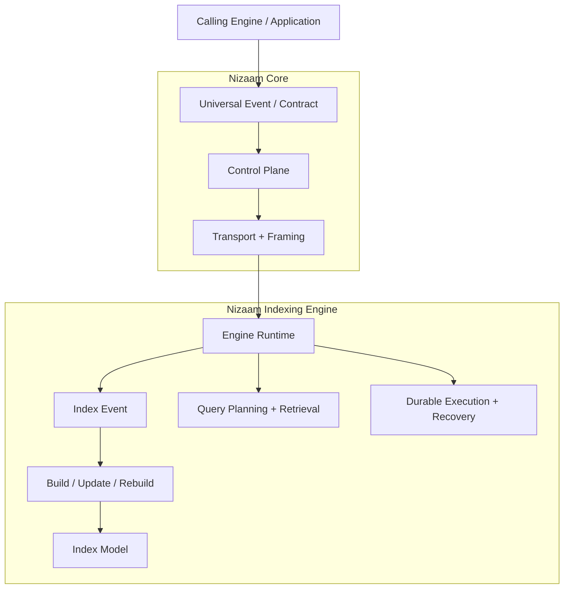

The critical ownership boundary is:

> **Indexing creates indexing semantics; Core carries and coordinates communication.**

The Indexing Engine therefore does not implement its own transport framing protocol. When an indexing engine needs to communicate with another engine, it produces the appropriate Core event/request and lets Core perform serialization, fragmentation, framing, transport, and delivery.

---

## Design Goals

The engine is designed around these goals:

- **Index-domain ownership** — indexing semantics live in the Indexing Engine.
- **Core reuse** — shared communication and runtime mechanisms come from Nizaam Core.
- **Typed models** — index definitions, keys, entries, versions, queries, and operations use explicit Rust types.
- **Deterministic planning** — query and build decisions should be reproducible from their inputs.
- **Version safety** — active index versions are protected from incomplete or failed work.
- **Durable execution** — important operation state is persisted so execution can be recovered.
- **Failure isolation** — persistence, validation, capacity, and execution failures are represented explicitly.
- **Bounded resources** — capacity accounting and execution limits prevent unbounded resource consumption.
- **Integrity first** — validation and consistency checks protect index state.
- **Testable contracts** — subsystem behavior is covered by unit, integration, conformance, fault, recovery, stress, and end-to-end tests.

---

## Architecture

The implementation is divided into domain and infrastructure responsibilities.

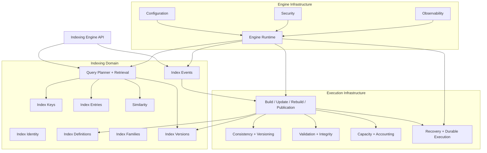

These components are intentionally separated. For example, query planning is not the same responsibility as physical build execution, and recovery is not the same responsibility as transport.

---

## Core Responsibilities

The current source tree is organized into the following major areas:

| Area | Responsibility |
| --- | --- |
| `identity` | Indexing-specific identity and namespace models |
| `index` | Index definitions, families, keys, entries, references, versions, queries, and similarity |
| `event` | Typed indexing events and event responses built around Core communication contracts |
| `query` | Query requests, planning, retrieval, and results |
| `build` | Builder, batch processing, update, rebuild, and publication workflows |
| `consistency` | Versioning, synchronization, and consistency policies |
| `integrity` | Validation and index integrity checks |
| `capacity` | Resource limits and accounting |
| `recovery` | Durable execution, failure handling, and recovery |
| `configuration` | Indexing engine configuration and immutable runtime configuration |
| `provider` | Provider capability and ranking abstractions |
| `security` | Indexing-side authorization requirement integration |
| `engine` | Engine registration, capabilities, runtime, lifecycle, and execution integration |
| `observability` | Logging, metrics, tracing, and diagnostics |
| `lifecycle` | Indexing lifecycle state |
| `requirement` | Indexing-specific execution requirements |

---

## Indexing Execution Flow

A normal indexing operation conceptually follows this path:

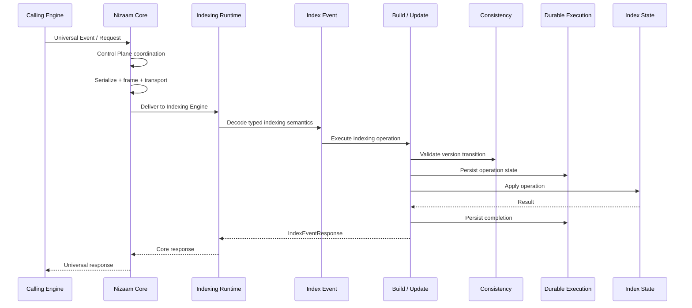

The exact path varies by operation, but the ownership boundary remains stable.

---

## Core Communication Boundary

Communication between engines belongs to Core.

An Indexing Engine creates a logical Core event/request and does **not** manually construct transport frames.


### What Indexing owns

- Indexing event semantics.
- Index definitions and state.
- Index build/update/rebuild operations.
- Query planning and retrieval semantics.
- Version and consistency rules.
- Durable operation records.
- Recovery behavior.
- Index-specific validation and capacity rules.

### What Core owns

- Universal communication contracts.
- Engine and engine-instance identity infrastructure.
- Control Plane coordination.
- Routing.
- Serialization infrastructure.
- Transport.
- Message framing and fragmentation.
- Shared runtime/lifecycle infrastructure.
- Shared security and observability mechanisms.

### Message framing boundary

The Core framing protocol currently allows a **20,000,000-byte maximum complete frame**. The corresponding payload maximum is **19,999,952 bytes** for the current 48-byte header.

Indexing does not redefine this limit.

If a logical Core message exceeds the transport payload limit, Core owns the fragmentation and reassembly process.

---

## Index Model

The `index` module contains the core indexing data model.

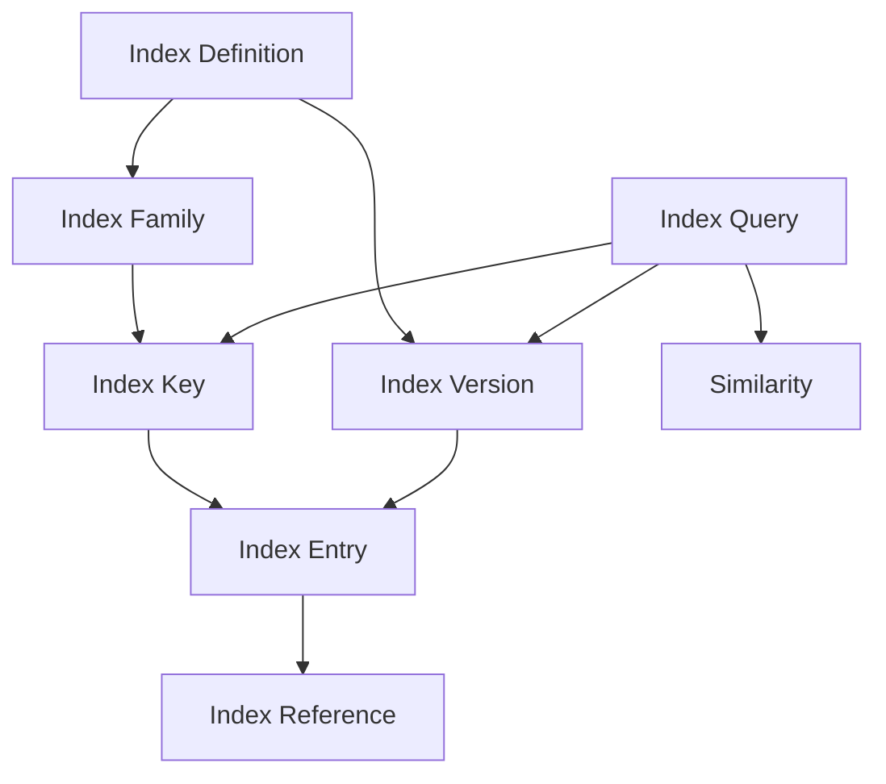

The implementation includes:

- index definitions;
- index families;
- typed keys;
- entries;
- references;
- versions;
- index-level query models;
- similarity-related models.

The model layer is intentionally independent from transport framing.

---

## Query System

The query subsystem separates request representation, planning, retrieval, and result representation.


The query implementation provides:

- query request models;
- planning;
- retrieval;
- query results;
- index-aware query behavior;
- explicit planning/execution separation.

A plan describes how a query should be executed. Retrieval performs the corresponding execution and produces a typed result.

---

## Build and Publication

The build subsystem owns index construction and update workflows.

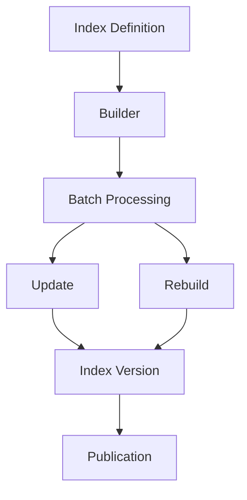

The build area currently contains:

- builder logic;
- batch processing;
- update workflows;
- rebuild workflows;
- publication workflows.

Publication is kept distinct from construction so that an incomplete build does not automatically become the active version.

---

## Consistency and Versioning

The consistency subsystem protects the relationship between index versions and execution state.

It contains:

- versioning rules;
- synchronization behavior;
- consistency policies.

A simplified lifecycle is:

```text
Candidate Version
       │
       ▼
   Build / Validate
       │
       ▼
   Consistency Checks
       │
       ▼
   Publication
       │
       ▼
 Active Version
```

A failed or incomplete operation must not silently replace a known-good active version.

---

## Integrity and Validation

The `integrity` module provides validation of indexing state and inputs.

Its responsibility is to detect invalid state before it becomes an accepted index state.

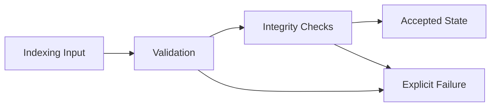

Validation remains separate from persistence and transport.

---

## Capacity and Resource Accounting

The capacity subsystem provides explicit resource limits and accounting.

It contains:

- capacity limits;
- resource accounting.

Capacity is an Indexing concern when the limit describes an indexing resource or operation. Core transport limits remain Core-owned.

This distinction is important:

```text
Core
 └── Message / transport capacity
      └── 20,000,000-byte maximum complete frame

Indexing
 └── Index operation capacity
      └── indexing-specific limits and accounting
```

---

## Recovery and Durable Execution

The recovery subsystem provides durable execution state and recovery behavior for indexing operations.

It contains:

- durable execution records;
- failure classification;
- recovery execution.

The execution lifecycle is conceptually:

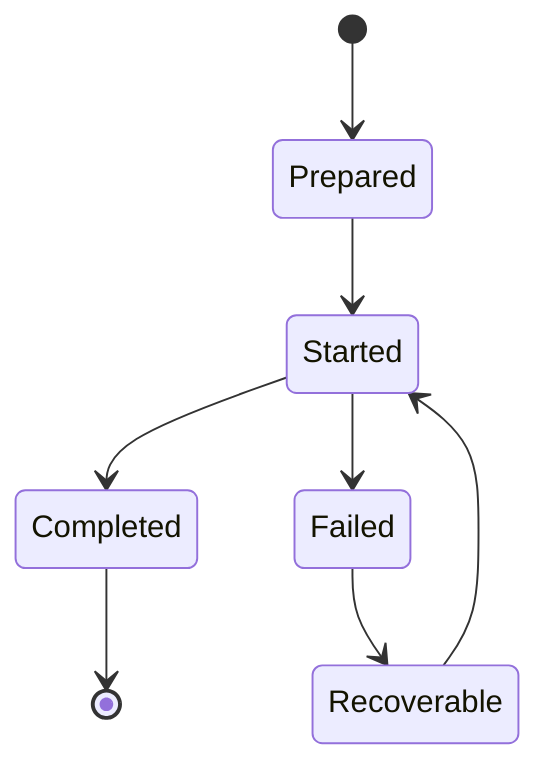

Durable execution is used to preserve enough state for a fresh engine instance to discover and recover incomplete work.

The repository also tests:

- persistence failures;
- recovery execution;
- idempotent execution;
- durable event/response snapshots;
- operation start/completion records;
- failure handling;
- preservation of known-good state.

Recovery is an Indexing responsibility. Core provides the surrounding engine/runtime infrastructure but does not own Indexing's durable operation semantics.

---

## Index Events

The `event` module provides the typed communication boundary for indexing operations.

An `IndexEvent` represents indexing-domain semantics while relying on Core's universal communication model underneath.


The event subsystem includes:

- typed index events;
- event payload encoding/decoding;
- event responses;
- preservation of Core communication identity;
- malformed payload rejection;
- round-trip behavior through the Core communication boundary.

The Indexing Engine does not create a second transport-level message identity or implement a second framing protocol.

---

## Configuration

The configuration subsystem provides validated runtime configuration for the Indexing Engine.

The configuration path is conceptually:

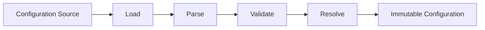

Runtime components consume the resulting configuration rather than depending on partially prepared configuration state.

---

## Security Boundary

The Indexing Engine integrates with Core's security infrastructure through an Indexing-specific authorization requirement.

The ownership boundary is:

```text
Core
 ├── authentication
 ├── security context
 └── authorization infrastructure

Indexing
 └── indexing-specific authorization requirement
```

Indexing does not create a second authentication system or replace Core's security context.

Authorization behavior is exercised through the engine's execution pipeline and security/conformance tests.

---

## Observability

The engine contains observability support for:

- structured logging;
- metrics;
- tracing;
- diagnostics.

Observability describes execution and system state without becoming the owner of indexing correctness.

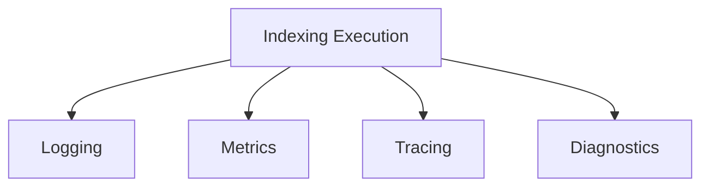

---

## Engine Runtime and Lifecycle

The `engine` module integrates Indexing with the Nizaam Core runtime.

It contains:

- engine capability definitions;
- registration integration;
- runtime setup;
- lifecycle handling;
- request/event execution integration.

The runtime owns engine-level execution concerns while the Indexing modules own indexing-specific work.

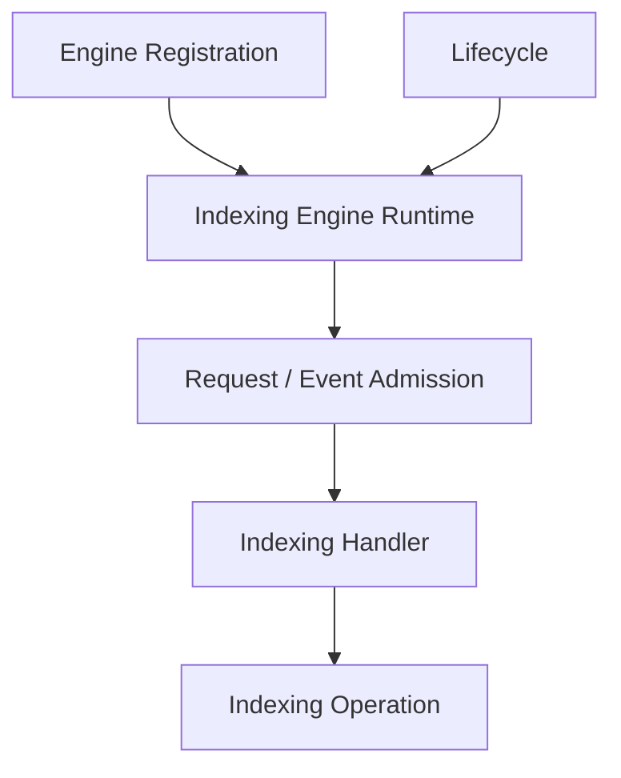

The runtime also creates and manages the engine's operation-root directory used by durable indexing execution.

On Unix systems, the default Nizaam directory is required to be owner-only when it already exists.

---

## Project Structure

The repository is a Rust library crate.

Current repository source structure:

```text
.
├── Cargo.toml
├── Cargo.lock
├── README.md
├── scope.md
├── src/
│   ├── build/
│   │   ├── batch.rs
│   │   ├── builder.rs
│   │   ├── mod.rs
│   │   ├── publication.rs
│   │   ├── rebuild.rs
│   │   └── update.rs
│   ├── capacity/
│   │   ├── accounting.rs
│   │   ├── limits.rs
│   │   └── mod.rs
│   ├── configuration/
│   │   ├── config.rs
│   │   └── mod.rs
│   ├── consistency/
│   │   ├── mod.rs
│   │   ├── policy.rs
│   │   ├── synchronization.rs
│   │   └── versioning.rs
│   ├── engine/
│   │   ├── capability.rs
│   │   ├── mod.rs
│   │   ├── registration.rs
│   │   └── runtime.rs
│   ├── event/
│   │   ├── index_event.rs
│   │   ├── index_event_response.rs
│   │   └── mod.rs
│   ├── identity/
│   │   ├── definition.rs
│   │   ├── index.rs
│   │   ├── mod.rs
│   │   └── namespace.rs
│   ├── index/
│   │   ├── definition.rs
│   │   ├── entry.rs
│   │   ├── family.rs
│   │   ├── key.rs
│   │   ├── mod.rs
│   │   ├── query.rs
│   │   ├── reference.rs
│   │   ├── similarity.rs
│   │   └── version.rs
│   ├── integrity/
│   │   ├── mod.rs
│   │   └── validation.rs
│   ├── lifecycle/
│   │   └── state.rs
│   ├── observability/
│   │   ├── diagnostics.rs
│   │   ├── logging.rs
│   │   ├── metrics.rs
│   │   ├── mod.rs
│   │   └── tracing.rs
│   ├── provider/
│   │   ├── capabilities.rs
│   │   ├── mod.rs
│   │   └── ranking.rs
│   ├── query/
│   │   ├── mod.rs
│   │   ├── planner.rs
│   │   ├── request.rs
│   │   ├── result.rs
│   │   └── retrieval.rs
│   ├── recovery/
│   │   ├── execution.rs
│   │   ├── failure.rs
│   │   └── mod.rs
│   ├── requirement/
│   │   └── requirement.rs
│   ├── security/
│   │   └── authorization.rs
│   ├── error.rs
│   └── lib.rs
└── tests/
    ├── build.rs
    ├── capacity.rs
    ├── concurrency.rs
    ├── configuration.rs
    ├── conformance.rs
    ├── consistency.rs
    ├── e2e.rs
    ├── engine.rs
    ├── event.rs
    ├── fault_injection.rs
    ├── identity.rs
    ├── idempotency.rs
    ├── index.rs
    ├── index_event.rs
    ├── integration.rs
    ├── integrity.rs
    ├── lifecycle.rs
    ├── observability.rs
    ├── persistence.rs
    ├── persistence_faults.rs
    ├── query.rs
    ├── recovery.rs
    ├── recovery_execution.rs
    ├── requirement.rs
    ├── security.rs
    ├── stress.rs
    └── common/
        ├── helpers.rs
        └── mod.rs
```

The archived repository snapshot contains **61 Rust source files** and **28 repository test/support Rust files**.

---

## Testing

Testing is distributed across implementation modules and repository-level integration tests.

The repository contains tests covering:

- build workflows;
- capacity and resource accounting;
- concurrency;
- configuration;
- consistency and versioning;
- engine lifecycle;
- identity;
- index models;
- index events;
- integration behavior;
- integrity;
- observability;
- persistence;
- persistence faults;
- query planning and retrieval;
- recovery;
- recovery execution;
- requirements;
- security;
- stress behavior;
- end-to-end behavior;
- architectural and cross-subsystem conformance.

The inspected repository snapshot contains:

- **604** `#[test]` functions in `src/`;
- **388** `#[test]` functions in `tests/`;
- **992** discovered `#[test]` functions in total.

These counts describe the archived source tree; they are not a claim that every test has been executed successfully.

Run the complete test suite with:

```bash
cargo test
```

For more focused verification:

```bash
cargo test --test conformance
cargo test --test index_event
cargo test --test recovery_execution
cargo test --test persistence_faults
cargo test --test e2e
```

---

## Architecture Principles

The following principles should guide future changes to the engine.

### 1. Keep Core and Indexing responsibilities separate

Core owns shared mechanisms such as communication, routing, transport, framing, and shared runtime infrastructure.

Indexing owns indexing semantics and durable indexing execution.

### 2. Do not duplicate Core infrastructure

Do not create a second implementation of:

- transport;
- message framing;
- serialization;
- Control Plane routing;
- engine registration;
- shared lifecycle infrastructure;
- Core identity generation;
- Core security infrastructure;
- Core observability infrastructure.

If Core already provides the mechanism, Indexing should compose with it.

### 3. Keep logical identities distinct

Do not merge different concepts merely because they participate in one operation.

For example:

```text
Core MessageId  != Core EventId
Core OperationId != Core AttemptId
Core EngineId   != Core EngineInstanceId
```

Indexing-specific identities must also remain semantically distinct from Core communication identities.

### 4. Keep planning separate from execution

Query planning should describe retrieval requirements.

Build planning should describe construction work.

Recovery should execute recovery behavior.

The runtime should coordinate execution without silently becoming the owner of indexing semantics.

### 5. Preserve durable state transitions

Operations that affect durable index state should have explicit transitions and durable records where required.

A crash or persistence failure must not silently produce an apparently completed operation.

### 6. Preserve active versions

A candidate, rebuilding, or failed version must not silently replace the known-good active version.

Publication is an explicit boundary.

### 7. Prefer deterministic behavior

Where the architecture requires deterministic planning, ordering, validation, or version decisions, the same valid inputs should produce the same result.

### 8. Test public contracts

Tests should primarily verify observable behavior and public contracts.

Internal implementation details should only be asserted when they are themselves part of the intended contract.

### 9. Fail explicitly

Invalid index definitions, invalid versions, capacity exhaustion, malformed events, persistence failures, invalid lifecycle transitions, unavailable resources, and recovery failures should be represented explicitly.

---

## End-to-End Architecture View

The following diagram summarizes the relationship between Core and the Indexing Engine.

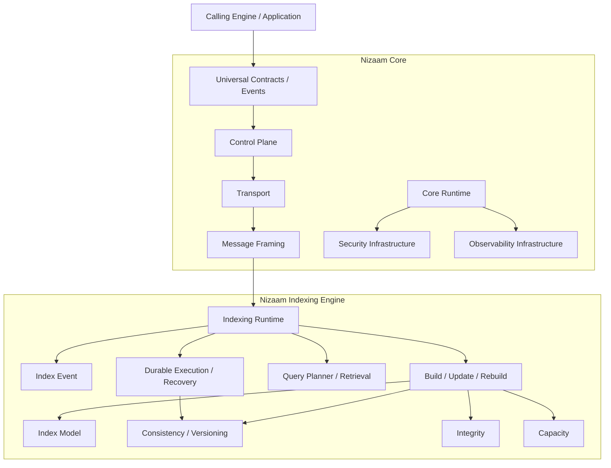

This is a conceptual architecture diagram. It does not imply that every subsystem directly depends on every other subsystem.

---

## Compatibility and Evolution

The Indexing Engine is designed to evolve independently while respecting Core's stable boundaries.

Important compatibility boundaries include:

- Core universal event/request contracts;
- Core identity types;
- engine registration metadata;
- capability advertisements;
- Core Control Plane routing;
- Core transport and framing protocol;
- Indexing event payload contracts;
- index definition and version models;
- durable operation records;
- configuration snapshots.

Changes to Core communication behavior should remain Core-owned.

Changes to Indexing semantics should remain inside the Indexing Engine unless they require an explicit Core contract change.

---

## Current Status

The repository snapshot used to prepare this README contains the implemented Indexing Engine foundation across:

- index identity and namespace;
- index definitions and data models;
- query planning and retrieval;
- build, update, rebuild, and publication;
- consistency and versioning;
- integrity validation;
- capacity and accounting;
- engine runtime and lifecycle integration;
- Core communication through typed index events;
- configuration;
- provider abstractions;
- security integration;
- observability;
- durable execution;
- persistence fault handling;
- recovery execution;
- idempotency;
- integration, conformance, stress, and end-to-end testing.

The implementation is documented in the accompanying `scope.md`.

Post-Phase 6 completion work is intentionally documented outside the numbered implementation phases in `scope.md`, including:

1. **Index Event / Universal Communication Completion**
2. **Durable Execution / Recovery Completion and Foundational Hardening**

These are descriptive bodies of completed work, not additional numbered phases.

---

## Getting Started

### Requirements

This project is a Rust library crate.

Use a current stable Rust toolchain compatible with the repository's `Cargo.toml`.

### Build

```bash
cargo build
```

### Run the test suite

```bash
cargo test
```

### Check the project

```bash
cargo check
```

For formatting and lint verification:

```bash
cargo fmt -- --check
cargo clippy --all-targets --all-features -- -D warnings
```

The exact feature set and lint configuration should follow the repository's current `Cargo.toml` and CI configuration.

---

## License

See [LICENSE](./LICENSE) for the repository's license.
